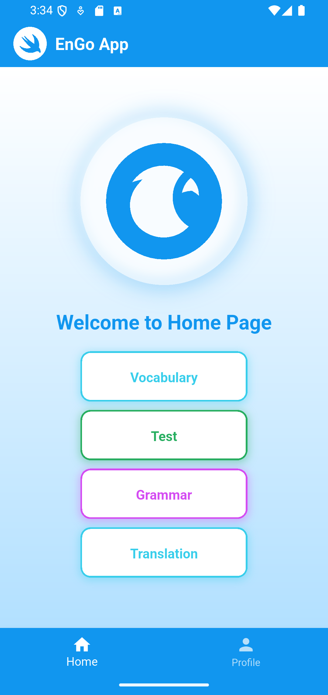
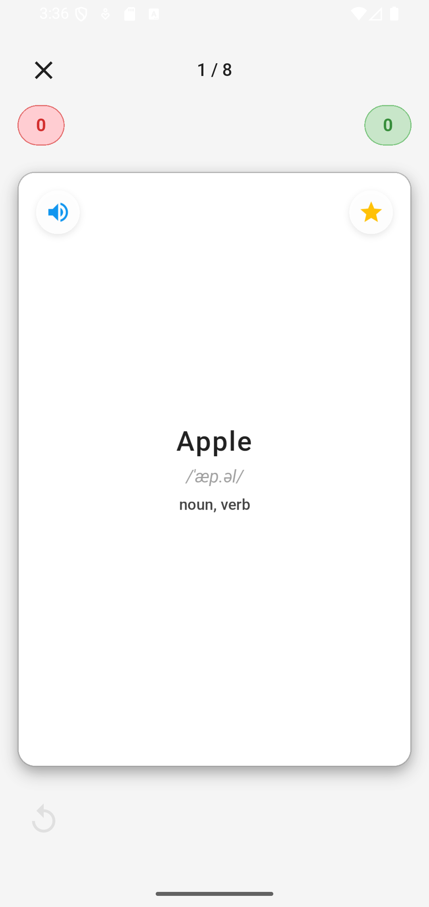
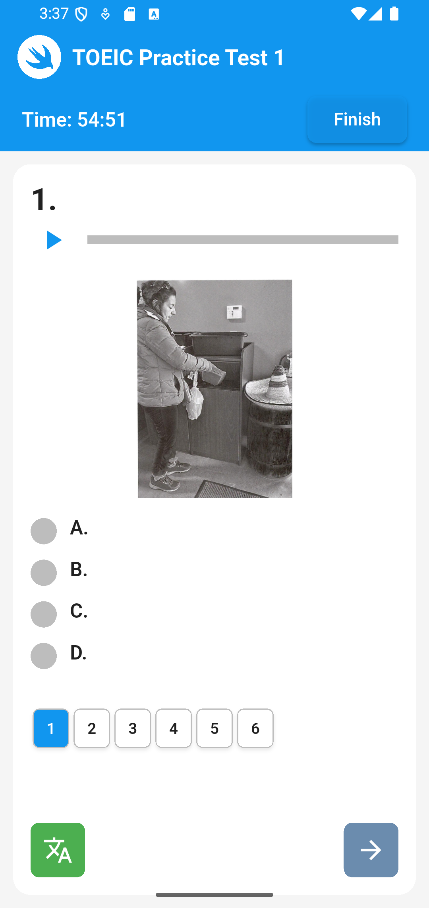

# EnGo App

<div align="center">
  
</div>
<h1 align="center">EngoApp - Ứng dụng học tiếng anh</h1>

<p align="center">
  
  
  
  
  
</p>

## 📱 Giới thiệu

**EnGo** là ứng dụng học tiếng Anh toàn diện được xây dựng bằng **Flutter**, tích hợp **Firebase** cho xác thực và lưu trữ dữ liệu. Ứng dụng cung cấp nhiều tính năng học tập như từ vựng, ngữ pháp, flashcard, bài test TOEIC và dịch thuật, giúp người dùng nâng cao khả năng tiếng Anh một cách hiệu quả.

## ✨ Tính năng chính

### 🔐 Xác thực & Cá nhân hóa

- **Multi-Login:** Hỗ trợ Email/Password và Google Sign-In.
- **Gamification:** Hệ thống **Streak** tạo động lực học tập hàng ngày.
- **Profile:** Quản lý thông tin và lưu trữ tiến độ học tập trên Cloud.

### 📚 Học tập thông minh (Smart Learning)

- **Vocabulary:** Học theo chủ đề hoặc tự tạo bộ từ vựng cá nhân.
- **Spaced Repetition:** Flashcard thông minh giúp ghi nhớ dài hạn.
- **Audio:** Tích hợp **TTS** giúp luyện nghe và phát âm chuẩn xác.

### 📝 Luyện thi & Dịch thuật

- **TOEIC Mastery:** Làm bài test như thật với hệ thống chấm điểm và lưu lịch sử.
- **Quick Translate:** Công cụ dịch thuật nhanh chóng hỗ trợ đọc hiểu tài liệu.
- **Grammar:** Hệ thống bài học từ cơ bản đến nâng cao kèm bài tập thực hành.

## 🏗️ Kiến trúc

<p>Ứng dụng được xây dựng theo kiến trúc <strong>Clean Architecture</strong> với 3 lớp chính:</p>

<table align='center'>
  <thead>
    <tr>
      <th>Lớp</th>
      <th>Công nghệ</th>
      <th>Mô tả</th>
    </tr>
  </thead>
  <tbody>
    <tr>
      <td><strong>Presentation</strong></td>
      <td>Flutter, Provider</td>
      <td>Giao diện người dùng, quản lý state</td>
    </tr>
    <tr>
      <td><strong>Domain</strong></td>
      <td>Dart, Equatable, Dartz</td>
      <td>Business logic, Use cases, Entities</td>
    </tr>
    <tr>
      <td><strong>Data</strong></td>
      <td>Firebase, HTTP, SharedPreferences</td>
      <td>Repository, Data sources, Models</td>
    </tr>
  </tbody>
</table>

### 📁 Cấu trúc thư mục

```
en_go_app/
├── lib/
│   ├── core/              # Core utilities, DI, themes
│   ├── data/              # Data layer (repositories, models, datasources)
│   ├── domain/            # Domain layer (entities, use cases)
│   ├── presentation/      # Presentation layer (UI, providers)
│   │   ├── pages/        # Screens
│   │   ├── providers/    # State management
│   │   ├── widgets/      # Reusable widgets
│   │   └── layout/       # Layout components
│   ├── routes/           # Navigation & routing
│   └── main.dart         # Entry point
├── assets/
│   ├── images/           # Images
│   ├── icons/            # Icons
└── android/              # Android specific code
```

## 🛠️ Tech Stack

### Core & Framework


### Architecture & State


-orange?style=for-the-badge>)

### Key Features & Utilities


## 📸 Screenshots

<div align="center">
  
  
  
  
</div>

---

## 👥 Contributors

<table align="center">
  <thead>
    <tr>
      <th width="20%">Thành viên</th>
      <th width="20%">Vai trò chính</th>
      <th width="60%">Nhiệm vụ chi tiết</th>
    </tr>
  </thead>
  <tbody>
    <tr>
      <td align="center">
        <a href="https://github.com/dak-1306">
          <br />
          <sub><b>Trần Hải Đăng</b></sub>
        </a>
      </td>
      <td align="center"><b>Team Leader</b></td>
      <td>
        • Luồng xác thực: <b>Login, Register, Welcome</b><br />
        • Giao diện chính: <b>Home Screen</b><br />
        • Quản lý thông tin: <b>Profile & Settings</b>
      </td>
    </tr>
    <tr>
      <td align="center">
        <a href="https://github.com/DiazMarco118">
          <br />
          <sub><b>Trần Hoàng Phương</b></sub>
        </a>
      </td>
      <td align="center"><b>Member</b></td>
      <td>
        • Phát triển toàn bộ module <b>Làm bài Test</b><br />
        • Xử lý logic <b>chấm điểm</b> và hiển thị kết quả bài thi
      </td>
    </tr>
    <tr>
      <td align="center">
        <a href="https://github.com/DannyTuanAnh">
          <br />
          <sub><b>Trần Tuấn Anh</b></sub>
        </a>
      </td>
      <td align="center"><b>Member</b></td>
      <td>
        • Hệ thống <b>Flashcard</b> học tập thông minh<br />
        • Công cụ <b>Dịch từ vựng</b> và các bài <b>Quiz</b> củng cố
      </td>
    </tr>
    <tr>
      <td align="center">
        <a href="https://github.com/TanDat-Ho">
          <br />
          <sub><b>Hồ Tấn Đạt</b></sub>
        </a>
      </td>
      <td align="center"><b>Member</b></td>
      <td>
        • Hệ thống kho từ vựng <b>Vocabulary</b><br />
        • Xây dựng bài học và bài tập <b>Ngữ pháp (Grammar)</b>
      </td>
    </tr>
  </tbody>
</table>
